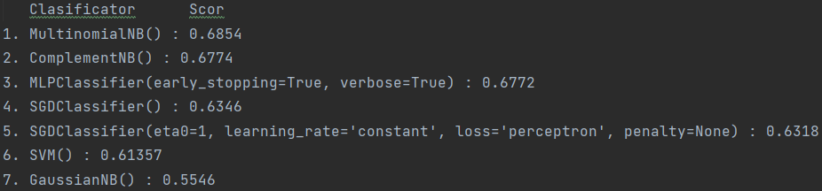
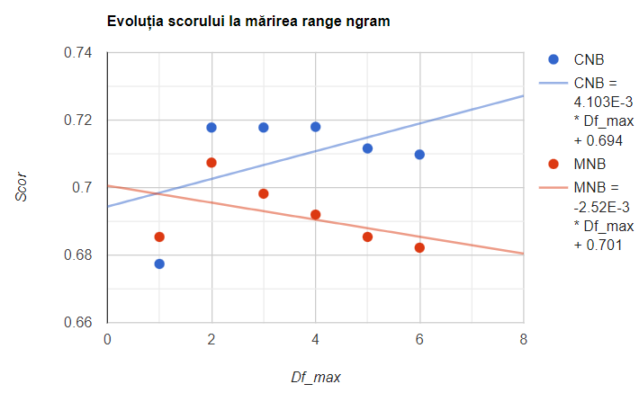
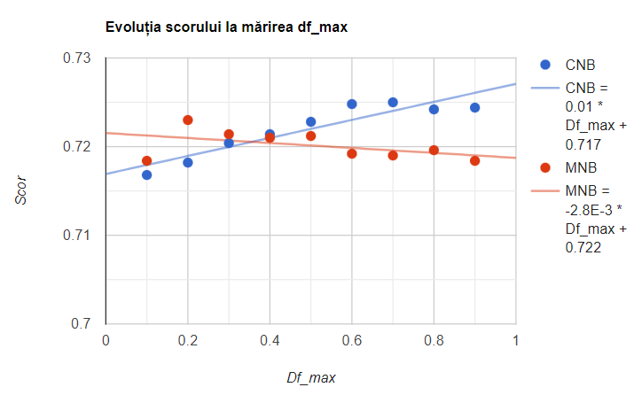
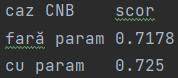
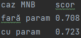
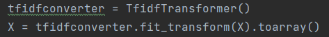
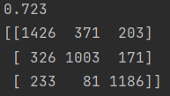
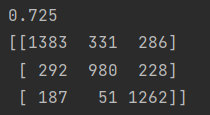

# Language detection

AI app which determines the language of a text out of 3 given 'alien' languages - Kaggle competition

### Table of contents:

I. [Introduction](#1)
II. [Data retrieval](#2)
III. [Initial data standardization](#3)
IV. [Choosing models for training](#4)
V. [Optimization of data processing](#5)
VI. [Conclusions](#6)

<a name="1"/>

### I. Introduction

---

This project is in the form of a Python program, developed within Jetbrains' IDE, Pycharm, and uses principles of self-learning taught in the Artificial Intelligence course. The purpose of this implementation is to be able to process files containing sentences written in three alien languages, with the help of machine learning algorithms, so that the language used can be predicted for any sentence.

<a name="2"/>

### II. Data retrieval

---

The files containing the input data are those generally used in the machine learning process:
- **train_samples.txt** & **train_labels.txt**:
contain the data (sentences and corresponding labels) that will be used to train the model;
- **validation_samples.txt** & **validation_labels.txt**:
contain the data (sentences and corresponding labels) that will be used to verify the efficiency achieved by the model;
- **test_samples.txt**:
the sentences based on which the Kaggle competition predictions will be made.

The input data does not have a uniform structure within the input files (they contain identifiers at the beginning of the line, the sentence length is not uniform), so reading them could not be done with a function from numpy (for example: np.loadtxt). Instead, for input retrieval I used manual data processing: reading the sentences from the file line by line, removing unimportant elements (identifiers, formatting characters - /n) and storing the sentences in lists corresponding to each document.

The output files are the CSV file (**RESULT.csv**) with the predictions based on the test data and the text files I use to log the data during the tests with the training models.

<a name="3"/>

### III. Initial data standardization

---

Starting from the read data set, an initial standardization of it is performed using the CountVectorizer() methods, having the parameters default, fit_transform() and transform() from the sklearn library. The purpose for which this data formatting is carried out is to make the transition from the initial string type data from the sentences to the int type data that can be processed by the ML algorithms.

Thus, based on the initial sentences, a vocabulary will be built that will be used to create characteristic vectors for each of the initial statements (the appearance of each word in the vocabulary is counted). Later, they will be included in a new matrix, equivalent to the original text, but based on which statistical operations can be performed: normalizations, averages, standard deviations, necessary for making predictions.

<a name="4"/>

### IV. Choosing models for training

---

To determine the model that lends itself best to the problem of identifying the language used in a text, I went through several types of classifiers: 
- **probabilistic**:
  Naive Bayes with its derivatives (Multinomial, Complement and Gaussian);
- **linear**:
  Stochastic Gradient Descent (SGD), Support vector machines (SVM) and Perceptron;
- **neural networks**:
  Multi-layer Perceptron (MLP). 

The results were as follows:

  

It can be seen that the training models with Naive Bayes (Multinomial and Complement) and the one with neural networks (MLPClassifier) ​​managed to obtain the best scores in the case of an input with a data standardization with default settings. These will be used further in the project.

<a name="5"/>

### V. Optimization of data processing

---

To increase the prediction performance of the learning algorithms, the dataset will need to be improved, so the default values of the parameters will be discarded and new ones will be provided. The arguments modified by me in the project were:
- `for CountVectorizer():`
    - `ngram_range` - retrieves substrings of text and compares them;
    - `max_df` - remove the most common words in the vocabulary that do not provide relevant information to the classification;
    - `analyzer = 'char_wb'` - on which elements the analysis will be performed, respectively ngram on the characters only inside the words;
    - `strip_accents = 'unicode'` - removing characters and normalizing them.
 - for classifiers, the hyperparameter alpha - doesn't make any improvement to the models I've tested, so it remains at default value 1.
 
##### MLPClassifier

For the neural network classifier, no significant improvements could be made, as both the training time increased exponentially with the introduction of ngrams (more than an hour and a half and the model was not completed) and the demand for resources (problems with the space allocated to the program, which reached up to 16 GB as a request).

##### MultinomialNB vs ComplementNB

The two types of classifiers are based on the Naive Bayes probabilistic principle, but they relate differently to the data distribution. MultinomialNB starts from the assumption that sentences are uniformly distributed, so that there is an even amount of utterances from each language, while ComplementNB takes into account a possible asymmetry in the amount of data from each language.

Following the optimization tests, the results were similar between the two models, the accuracy being slightly higher for CNB (0.725 - best case) compared to MNB (0.723 - best case).

The values for `ngram_range` and `max_df` fluctuate in performance from model to model. Thus, CNB has an increase in score as soon as the ngram horizon increases, while at MNB a stabilization can be observed over time.

  

Regarding the score increase following the change of the df_max value (to `ngram_range(1,5)` for both models), the results can be seen below.

  

Using `analyzer: 'char_wb'` and `strip_accents: 'unicode'` together leads to an increase in model performance, regardless of the type of model tested.

  
  

Using TFIDF ('Term Frequency – Inverse Document Frequency') data formatting did not improve the score. This consisted of calculating a score for each word where overall frequency was correlated with absolute frequency across all texts.

  

Accuracy score and confusion matrix for the MultinomialNB case with `CountVectorizer(ngram_range=(1, 5), max_df=0.2, analyzer='char_wb', strip_accents='unicode')`

  

Accuracy score and confusion matrix for the ComplementNB, representing the best case obtained by me in this project:
`CountVectorizer(ngram_range=(1, 5), max_df=0.7, analyzer='char_wb', strip_accents='unicode')` 

  

 
<a name="6"/>

### VI. Conclusions

---

In the case of my tests, **Native Bayes** learning algorithms had the best performances, obtaining for ComplementNB a score of 0.725 on the validation data and 0.71394 in the contest held on the Kaggel platform.
